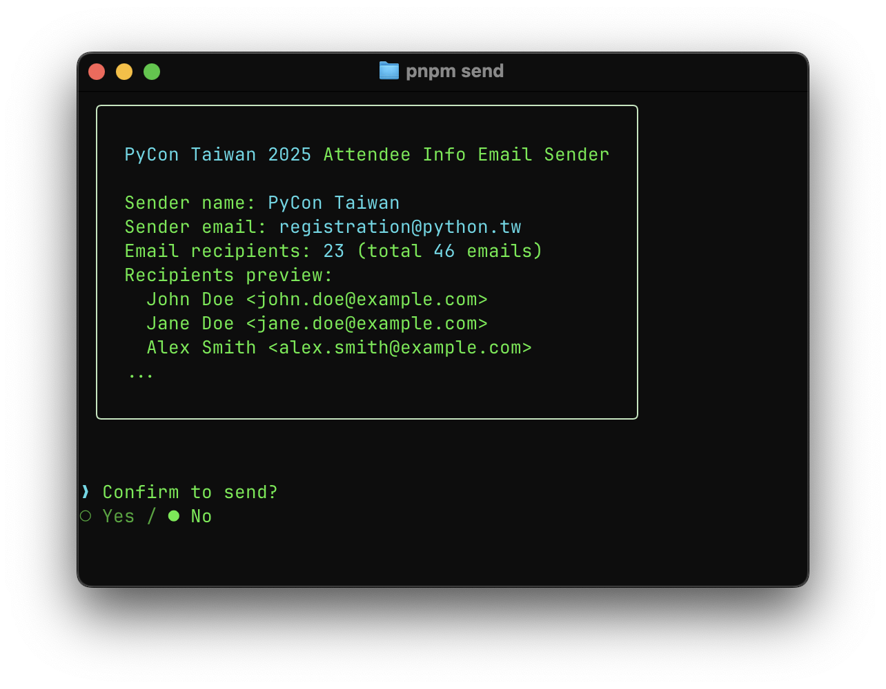

# PyCon Taiwan Attendee Info Email

Generate and send attendee information emails for PyCon events.

*For PyCon TW Volunteer Registration Team internal use.*

## Getting Started

- Use [pnpm](https://pnpm.io/) as package manager
- Node.js v22+ is recommended

```sh
pnpm i
```

### Send Email



1. Create `.env` from `template.env` for MailerSend API keys.
2. Create `recipients.yaml` from `template.recipients.yaml` for email recipients.

```bash
pnpm run send
```

## Development

Email templates are located in the `emails` directory.

```bash
# start development server
pnpm run dev

# export email preview
pnpm run export
```


## License

MIT License © [SerKo](https://github.com/serkodev)
